## はじめに

※このページはMisskeyサーバー「ゲームすきー（misskey.gamelore.fun）」のユーザー主催企画用に執筆したものです。

突然ですがWizardryというRPGシリーズをご存知でしょうか。
先日スマホで『Wizardry Variants Daphne』がリリースされて盛り上がっていますが、
今回はあえて『Wizardry外伝 五つの試練』(以下、五つの試練)を紹介したいと思います。

[ストアページ](https://store.steampowered.com/app/1308700/Wizardry/)

※Nintendo Switch 版も 2025/01/30 発売予定です

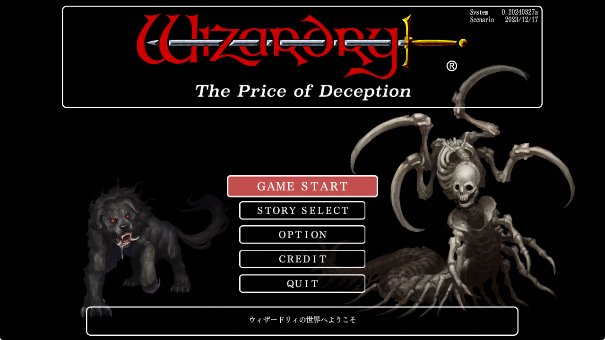

## Wizardry について

### 歴史

Wizardryは1981年にリリースされたRPGで、広く一般に販売された作品[^plato]としては**ほぼ最古**のコンピュータRPG (CRPG) です。
コーネル大学の学生だった Robert Woodhead 氏と故 Andrew C. Greenberg 氏によって開発されました。
当時は紙とダイスを使って遊ぶ物だった RPG をコンピュータで遊べるようにするのが主な狙いで、世界観にダンジョンズ&ドラゴンズ[^dnd]の影響が濃く見られます。

オリジナルは Apple II というPC向けでしたが、国内でもアスキーによって (NECなどの) 国産PC、ファミコン、ゲームボーイカラーなど様々な機種に移植され、人気を博しました。
さらに、日本独自の展開として「外伝」などの派生シリーズが製作され、その系譜は女神転生やエルミナージュ、世界樹の迷宮などに受け継がれました。

### システム

ゲームはザックリ以下の流れで進みます。

1. キャラクターを作成する
2. パーティーを編成する
3. ダンジョンを探索する
4. 拠点へ戻り、回復などを行う
5. 以下、3と4の繰り返し

作品によって異なりますが、ダンジョンの最下層に潜むボスを倒したり特定のアイテムを持って帰ることでクリアとなります。
キャラクター作成では種族や職業が選択でき、肉弾戦が得意な職業や魔法を習得できる職業などバランスを考慮して編成する必要があります。

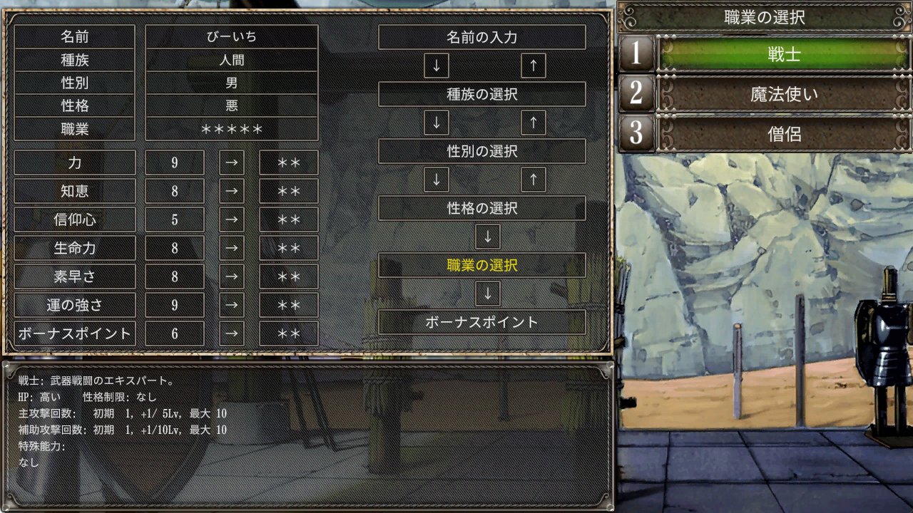

ダンジョン探索は疑似3Dと呼ばれるシステムで進行し、二次元の平面上に表現されたフロアを前後左右に移動できます。
各フロアは壁や扉の他、別のフロアへ移動する階段、視界が効かなくなるダークゾーン、踏むとダメージを受けるピット (落とし穴) など様々な要素で構成されています。

ダンジョン内で全滅したパーティーはその地点に置き去りになってしまうため、別のパーティーを組んで (あるいは予め育てておいて) 回収しに行かなければなりません。
パーティーのリソース残量に常に気を配り、撤退のタイミングを見極めることが重要です。

ダンジョンを探索しているとモンスターとの戦闘が発生します。
戦闘はシンプルなターン制で、キャラクター全員の行動を選択した後に、モンスターの行動含め実行フェーズに移るような形式です。
モンスターは複数のグループで襲ってくる[^group]場合があり、こちらもグループ攻撃の呪文などで適切に対応する必要があります。

特筆すべきはそのシビアさで、残りHPに関わらず一撃で倒されてしまうクリティカルヒットや、**レベルを下げられる**エナジードレインなど嫌らしい攻撃をする敵が結構ポンポン出てきます。

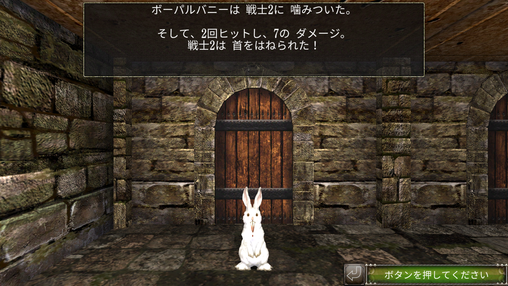

さらに、仮に戦闘に勝利したとしても、アイテムやお金を手に入れるには罠がかけられた宝箱を開けなければなりません。
罠の解除に失敗すればパーティー全員がダメージを受けたり、ランダムな座標に転送されるなどの被害を受けます。

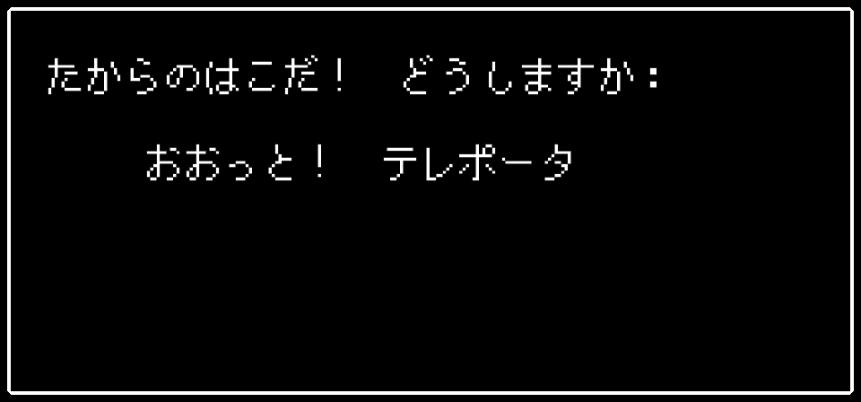

他にも、昨今では当たり前になった**マップ表示が無かったり**[^difficulty]回復呪文の**回復量がショボすぎ**たりと難しい所はあるのですが、
レアアイテムを求めてダンジョンに潜り、敵を倒しては地上に帰るスタイル (ハックアンドスラッシュ) は中毒性が高く、コアなファンが多く付きました。

## 五つの試練について

**本題に入ります。**
『Wizardry外伝 五つの試練』はアスキーの元スタッフである徳永剛氏と金田剛氏が中心になって開発され、2006年にIRI-CT (現：イード) から発売されました。
本作の最大の特徴は、デフォルトで5本のシナリオ[^scenario]が用意されていることと、**ユーザーがシナリオを作成できる**シナリオエディタが配布されていることです。
結果、これが多数のユーザーに利用されることになり、延べ123件のユーザーシナリオが作成されました。
発売から16年の間、毎年1つは (エンディングまで遊べる状態の) シナリオが公開され続けたのも驚きです。

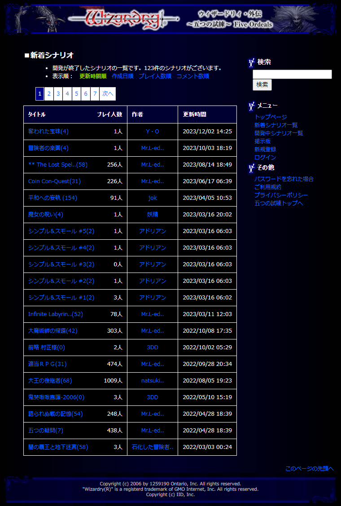

そんなこんなで長年愛されてきた五つの試練ですが、更新が止まっていたこともあって徐々に互換性の問題が出始めます。
また、インストールに当たってシリアルコードによるオンライン認証が必要であり、PCの買い替え時には公式に問い合わせて認証を解除してもらう必要があるなど、システム面でも不便が目立つようになります。

そこで徳永氏は、Unityを使って現行OSに対応した五つの試練を製作し、将来的な展開も見据えてSteamで公開しました。
基本的なシステムはそのままにUIの改善や不具合の修正が行われており、クラシックなWizardryを遊びたい人には今一番お勧めしたい作品です。

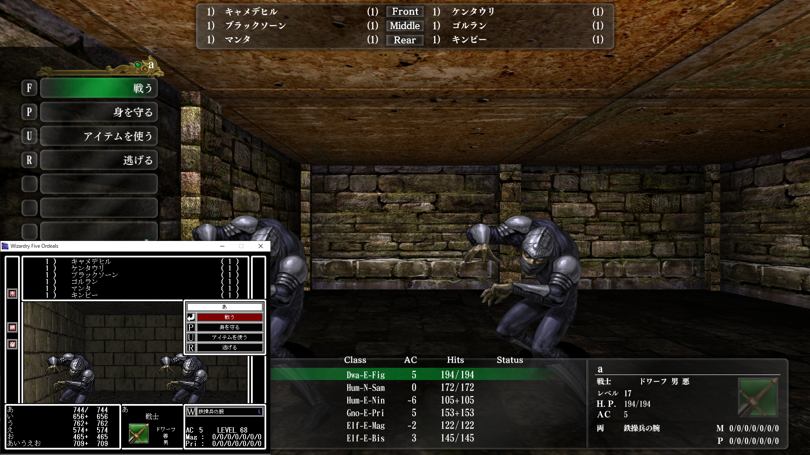

旧版のシナリオがほぼ全て遊べる上に新たなシナリオも作られ続けているので、執筆時点では『**Wizardry外伝 188つの試練**』(DLC含む) になっています。
シナリオ1つ辺り**21.2**円という破格のコスパです。ヤバすぎる。

##  シナリオ紹介

とは言え、Steam版から新たに遊ぶ人は、188個のシナリオからどれを選ぶか迷うと思います。
シナリオ選択で作者のコメントや大まかなデータは確認できますが、せっかくなので筆者のプレイ済みシナリオからオススメをいくつか紹介します。※一部スクリーンショットは旧版の物です。

### 灼熱の車輪

製作：白石 晃裕

灼熱の車輪は公式が用意した五本のシナリオの1つです。
本作の最大の特徴はメタル音楽のネタが盛り込まれた異様な世界観で、**このシナリオのために作られた**BGMが多数用意されています。
アイテムは本家ファミコン版に準拠した物が多いですが、モンスター名はほぼ全て差し替えられており、ブラックサバスやメタリカ、ジューダスプリーストなどの楽曲ネタが押し寄せます。

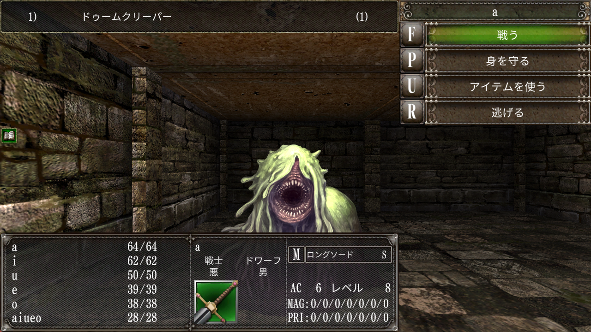

ざっくりとしたストーリーは、異教徒を討伐しに行って行方不明になってしまった「鋼の王」という人物を探し出すことなのですが、
舞台となるダンジョンは廃棄物処理場があったり鍛冶屋があったり**クラブ**があったりとカオスな様相です。
なんなら件の「鋼の王」も知ってる人が見れば何となく分かるレベルのパロディ。

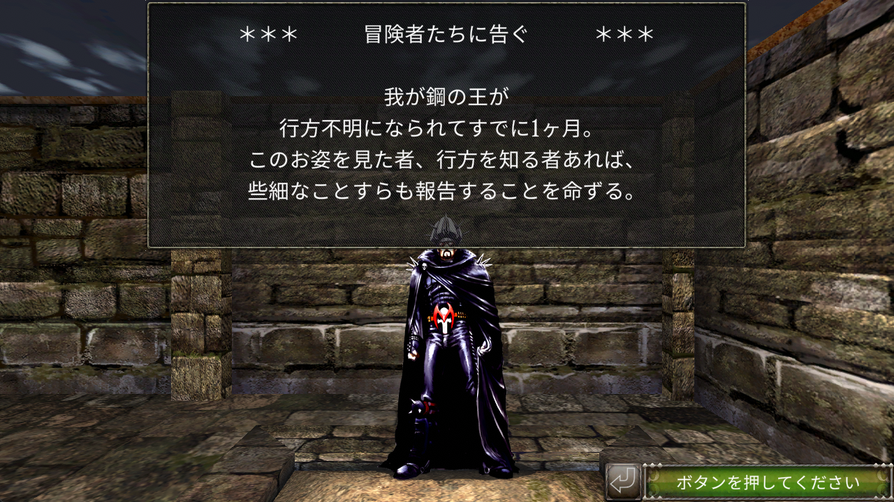

そんな癖のある世界観が魅力の本作ですが、実はダンジョンの造りや戦闘バランスは比較的オーソドックスでサクッと遊べます。
他のシナリオはボリュームが大きかったり謎解きが難しかったり[^prisoner]するので、五本のシナリオの中では一番オススメです。

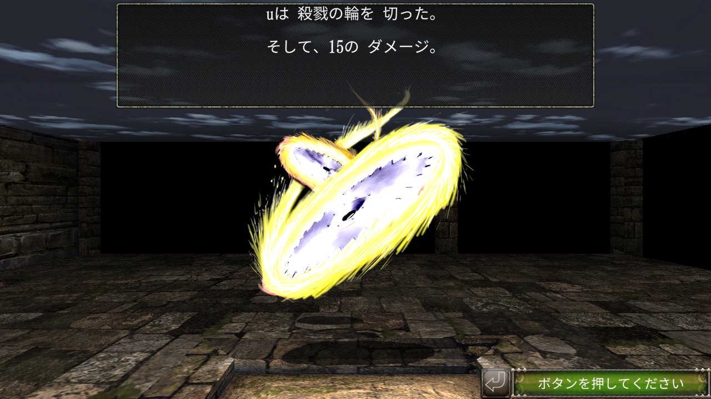

### まぼろしのしあわせの実

製作：松友健

Wizardryの世界には5つの種族があり、それぞれ向いている職業が異なるのですが……  
以下、作者様のホームページからの引用です。

> ドワーフって強いですね。力があってタフで、信仰心も厚い。戦士にすれば頼もしく、僧侶にすれば安心させてくれます。  
> エルフも優秀ですね。５種族中で一番魔法を使いこなせます。ウィザードリィの世界では魔術師も僧侶もとても重要な職業。外見が美しいというイメージもあってか、ほとんどのパーティには居ると思います。  
> ノームはバランス良くまとまっていて、欠点がありません。彼らに頼る人も多いと思います。僧侶への適正は最高、パーティの生命線と言えるでしょう。  
> 人間は、当たり前ですけど一番使われている筈です。お気に入りの漫画・映画・小説などから名前を使わせてもらえば、感情移入度もひとしおです。  
>   
> ホビット？ああ、盗賊の材料ね。そんな奴もいたな。アレ要るの？他に何させてもどうしようもねぇし。BCFからフェアリーでもひっぱって来てくれない？  

※1：BCF = Bane of the Cosmic Forge。本家シリーズの6作目  
※2：Steam版では版権の都合かホビットからホブ表記に変わりました

ということで、盗賊への適性以外はいまいちパッとしないホブが**超優遇**された本作。
他の種族を使うことも出来ますが、性能の良い装備はたいていホブ専用なので難易度が上がります。

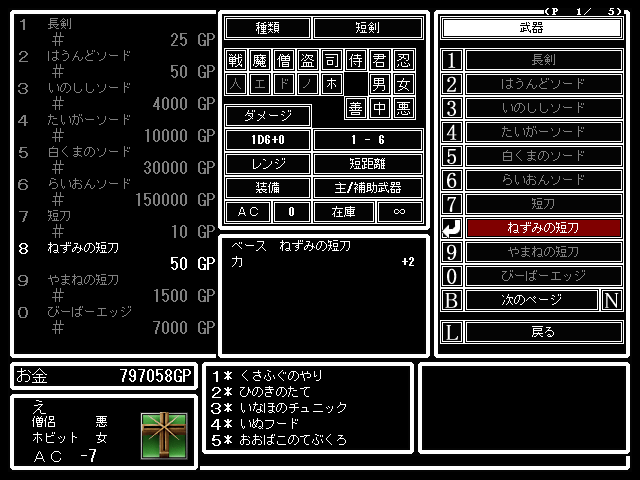

ダンジョンは全体的にテレポーター[^teleporter]が多く手ごわい造りになっています。
呪文で確認できるマップにはトラップの詳細などが表示されないため、人によってはメモが必要かもしれません。
戦闘バランスは (ホブオンリーなら) ちょうどよく、適度にレベル上げしていれば進めると思います。

また、ゲームブック作家でもある作者様のテキストも本作の魅力です。
読むだけで脱力するような城の看板、**すけるとん**など平仮名のモンスター名、ですます調のイベントメッセージなど全体的に緩い雰囲気が漂っています。

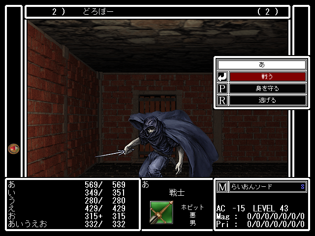

### 失われた金を求めて

製作：Mr. L-ed

ダンジョン最下層に潜むボスを倒す……のではなく、「とにかくお金を稼ぐ」のが目的のシナリオです。
**敵を倒してもお金が手に入らない**ので、アイテムを売却してお金を貯めていきます。
シナリオクリアの証である称号も、店で売られている高額なアイテムを購入することで入手可能です。

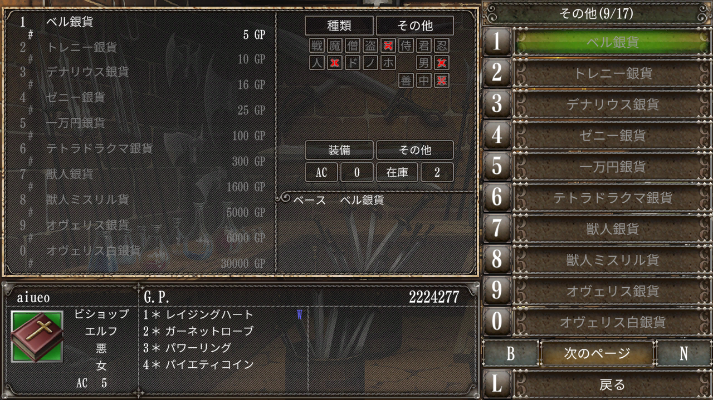

シナリオの特性上、宝箱の罠解除が得意な盗賊 (もしくは忍者) と不確定アイテム[^uncertained]の鑑定ができる司教が必須にはなりますが、そんな制限も気にならない完成度です。
お金が絡む独特な謎解きは上に挙げたシナリオよりも難しめですが、ヒントもゲーム内にきちんと用意されています。
クリアに必須でないイベントも多いので、どうしても分からない場合はスルー可能なのもありがたいです。

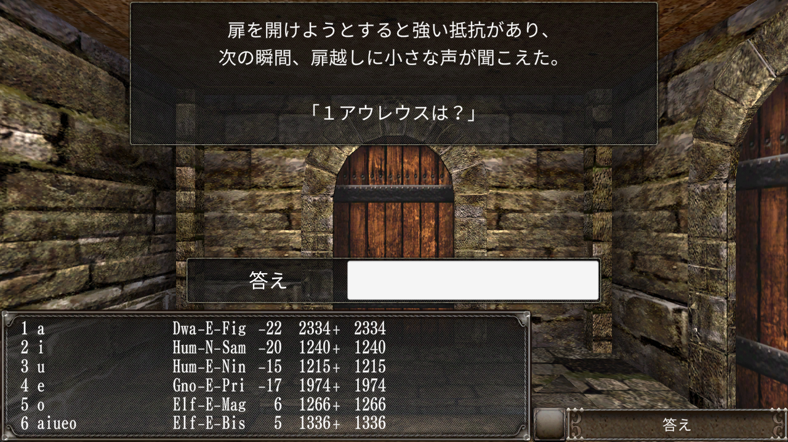

また、終盤のレアアイテムの出現率が絶妙でハクスラの楽しさを存分に味えるのも個人的に好きポイントです。
アイテム約350個、モンスター約290体とかなりのボリュームなので、じっくりと腰を据えて遊びたい時にオススメです。

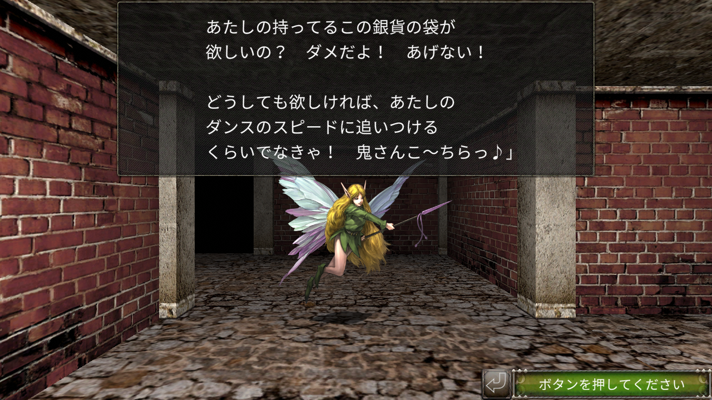

### 災いの塔

製作：Soulshaker

正方形の枠に囚われないマップと次々に変わる舞台が特徴のシナリオで、
洞窟を抜けて廃城を探索したり海に漕ぎ出したり山を登ったりといった冒険感が味わえます。
こうした探索のスタイルは (作者様自身が言及していますが) 本家のBCFに近く、テキストの要所要所に過去作のオマージュが見られるなど本家への愛も感じられます。

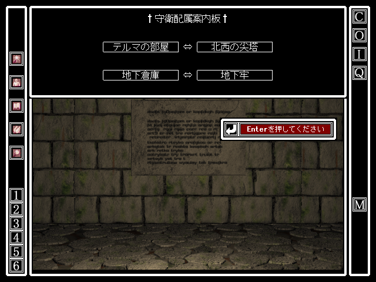

戦闘バランスも難しすぎないレベルでちょうどよく、アイテム収集に役立つ「異空間」と呼ばれるシステムも用意されています。
フロア数がかなり多く、ボリュームも大きいのでこちらもじっくり遊びたい人向けです。

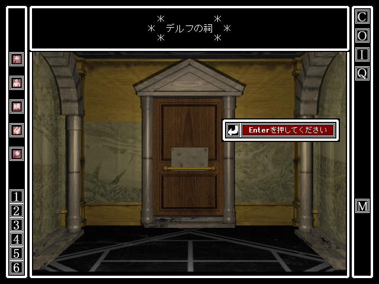

### 大王の後継者

製作：natsuki

ユーザーシナリオ最難関の候補によく挙げられる**激ムズ**シナリオ。
ストーリーは古代メソポタミアを題材とした歴史ものなのですが、
敵の経験値が低めに抑えられているため戦闘が非常に厳しく、謎解きも類を見ない難易度です。

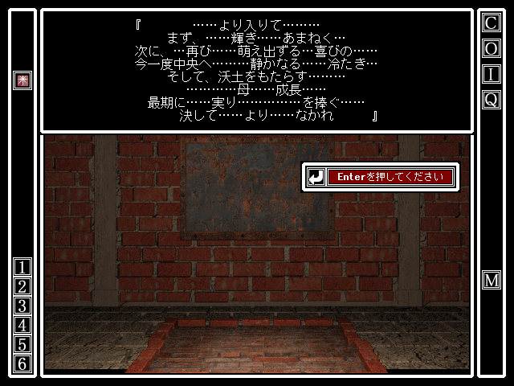

今でこそ情報が出揃ってきて詰まりにくくはなりましたが、十数年前に初めて遊んだプレイヤーたちは相当苦しんだと思います。
旧版の頃よく使われていた外部掲示板に本作の相談スレッドが建っていますが、
他シナリオのスレッドの書き込み数が10～100件ほどなのに対し、本作は**430件**というのが色々と物語っています。

それでも、いくつかシナリオをクリアして慣れてきた頃にプレイしてみて欲しい作品です。
シナリオエディターを最大限に使った仕掛けの数々は一見の価値あり。
これをクリア出来たら大抵のシナリオはクリアできると思います。(リセット[^reset]有りでもムズい)

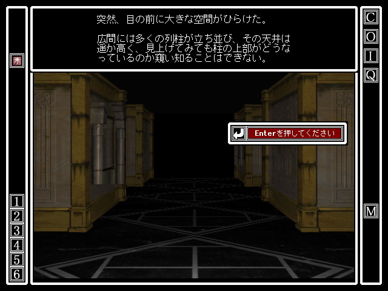

他にも多種多様なシナリオがありますが、紹介しきれないのでこの辺りにしておきます。**嘘です。**全然足りないのでもう10個だけ挙げさせてください。

・**マジックフォース+**：1フロアしかない超短編です。ノリも軽いので気負わず遊べます。

・**千年金庫は破れるか'**：パズルに特化したシナリオで、戦闘は限られた場面でのみ発生します。シナリオエディターの仕様を熟知したパズルはどれも唸らされる出来です。  

・**Infinite Labyrinth**：テレポートの罠を逆手にとってランダム生成ダンジョンを疑似的に再現したシナリオ。エディターの仕様により完全なランダムではありませんが、出口が分からない緊張感が何度も味わえます。  

・**太陽の住人**：エジプトのピラミッドやマヤのチチェン・イッツァのような、上に行くほど狭くなるダンジョンを探索します。異国情緒あふれるテイストが素敵です。  

・**聖者の経典**：Wizardryとほぼ同時期に発売されたUltima[^ultima]というRPGのオマージュシナリオです。元ネタを知っている人はニヤリと出来る再現度の高さ。  

・**遺跡に眠るもの**：50層に及ぶ地下迷宮の最下層を目指すシナリオ。ショートカットもほどほどに開通するので安心です。比較的シンプルなフロアが多いですが時々凝った仕掛けも。  

・**霞ヶ関異聞**：ストーリーと謎解きを捨てた異色作。探索してエンカウントエリアを開放し、ハクスラ……を繰り返していきます。  

・**呪われた王都**：設定の凝り具合とストーリー展開が素晴らしい。クリア後のインフレダンジョンも好きです。  

・**大魔術師の帰還**：本家シリーズ一番の怪作『ワードナの逆襲』のオマージュシナリオ。モンティ・パイソン[^monty-python]のパロディが飛び交う独特な雰囲気が◎。

・**夢見ル胡桃**：開発中シナリオの一覧にありますが、英訳が終わっていないだけで最後まで遊べます。マップと謎解きの難度は最難関レベルですが、独特のモンスター達が癖になります。  

作者毎に個性が出るので、気に入ったシナリオがあれば同じ作者の作品を遊んでいくとよいです。

## 宣伝

**令和にもなって**サーバーをレンタルし、プレイ記録を兼ねたユーザーシナリオの攻略情報をまとめています。
旧版の頃に作成したページが多く、Steam版に更新できていない部分がまだ多いですが、旧版から大きな変更がないシナリオについては参考になるかもしれません。
未発見アイテムなどの情報収集も受け付けています。

[FOの庵](https://fo-io.com/)

## おわりに

以上、Steam版『Wizardry外伝 五つの試練』の~~オタク語り~~紹介でした。

## クレジット
* 画像
  * ゲーム画面スクショ
    * &copy;IID, Inc.
    * &copy;59 Studio.
    * Wizardry&trade; is a trademark of Drecom co.,Ltd
  * いらすとや:[https://www.irasutoya.com/](https://www.irasutoya.com/)
* フォント
  * PixelMplus:[https://github.com/itouhiro/PixelMplus](https://github.com/itouhiro/PixelMplus)
* テキスト
  * 駄人間生誕:[http://matutomoken.web.fc2.com/](http://matutomoken.web.fc2.com/)
* 参考
  * [Robert Woodhead 氏へのインタビュー](https://www.4gamer.net/games/044/G004471/20160407001/)
  * [Metal Page](https://metal.the-ninja.jp/Bardstale/1/play08.html)
  * [旧版公式サイト](https://wiz-pb.jp/editor/list.jsp)
  * 自分の記憶

[^plato]:
最初期のCRPGは、PLATOと呼ばれる大学の教育支援システムの中で発展しました。PLATOの本来の用途は実験のシミュレーションやオンラインコミュニケーションでしたが、やがて暇を持て余した学生たちの手により、いくつものゲームが実装されます (勉強しろ)。
興味がある方はPLATOやpedit5で調べてみてください。

[^dnd]:
1974年に発売されたテーブルトークRPGで、最古のRPGとも言われています。どういう経緯か2023年に映画化されました。

[^difficulty]:
オリジナル版ではパーティーの座標 (地下N階の x:〇, y:〇 のような形) しか確認できなかったため、方眼紙等に自分でマップを書いていました。セガサターン版辺りからは自動でマッピングされるようになり、比較的簡単にマップを確認できます。

[^scenario]:
TRPG由来の用語です。五つの試練においては、バックストーリーやダンジョンの構造、イベントやメッセージ、モンスターなどのデータを含む、「プレイヤーが冒険する舞台」の単位という感じです。RPGツクールで言えば完成したゲームに相当します。

[^prisoner]:
今回は省略しましたが、そもそも五つの試練自体が『戦闘の監獄』というゲームの続編に近いため、難易度が高いのは仕方がないかもしれません。

[^reset]:
CtrlキーとF1キーを同時押しするとタイトルに戻ります。

[^ultima]:
1981年に1作目が発売されたRPGシリーズです。ドラゴンクエストでお馴染みとなった、「フィールドマップ上で町のアイコンに重なると町マップに切り替わる」というシステムの元祖と言われています。

[^group]:
モンスターによって設定は異なりますが、1グループにつき9体が上限です。またグループ数の上限は4グループとなっているので、最大で36体を相手にする可能性があります。
余談ですが『The Bard's Tale』という (これまた古い) RPGは1グループ99体までとなっており、最大で396体を相手にするそうです。ヤバい。

[^teleporter]:
ダンジョンのトラップの1つで、踏み込んだパーティーを特定の座標へ強制移動させます。メッセージが表示されないのが嫌らしいところです。

[^uncertained]:
宝箱から手に入るアイテムは未鑑定品となっており、詳細が分からなかったり売却が不可能だったりします。司教か商店に鑑定してもらうことで確定状態にすることができます。

[^monty-python]:
70～80年代に活躍したイギリスのコメディグループです。その筋では有名な話ですが、プログラミング言語 Python の由来になっています。